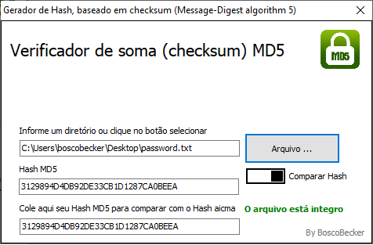

# Verificador de integridade de arquivos Hash MD5

# Features
* Suporta quase todas as plataformas Windows, incluindo Microsoft Windows 95, 98, 2000, Me, XP, 2003, Vista e Windows 7.
* Rápido e multi-threaded. Pode calcular um arquivo de 2 GB a menos de 1 minuto.

* Suporta arquivos grandes com mais de 4 GB.
* Baixo uso de recursos. Utiliza menos de 5 MB de RAM.
* Não requer o tempo de execução do .NET instalado. É um arquivo EXE autônomo e a inicialização é rápida. 
* Suporta verificação do valor MD5 original e do valor MD5 atual.
* Mais importante, é grátis. Nenhum pacote de spyware ou adware.
* Tamanho pequeno, uma ferramenta eficaz e minúscula para segurança de dados.

# Sobre soma de verificação

Checksum ou soma de verificação é um código usado para verificar a
 integridade de dados transmitidos através de um canal com 
ruídos ou armazenados em algum meio por algum tempo.

#Funcionamento

Isto é feito calculando a soma de verificação dos dados antes 
do envio ou do armazenamento deles, 
e recalculá-los ao recebê-los ou recuperá-los do 
armazenamento. 
Se o valor obtido é o mesmo, as informações não sofreram 
alterações e portanto não estão corrompidas.

Formas mais simplificadas destas somas são vulneráveis por 
não detectarem algumas formas de falha. 
A simples soma dos valores dos caracteres por exemplo é 
vulnerável a troca de ordem dos mesmos pela comutatividade da soma.
 Há formas mais elaboradas de se calcular estas somas que 
resolvem estes problemas, como por exemplo, o Cyclic Redundancy Check (verificação de 
redundância cíclica) ou CRC muito utilizados para detecção de falha através da divisão 
de polinômios.

# Sobre o MD5 (Message-Digest algorithm 5) 

O MD5 é uma função de dispersão criptográfica
 (ou função hash criptográfica) de 128 bits unidirecional 
desenvolvido pela RSA Data Security, Inc., descrito na RFC 1321, e muito 
utilizado por softwares com protocolo ponto-a-ponto
 (P2P, ou Peer-to-Peer, em inglês) na verificação de integridade 
de arquivos e logins.

Fonte: https://pt.wikipedia.org/wiki/Soma_de_verificação
Fonte: https://pt.wikipedia.org/wiki/MD5

Make with love - @boscobecker
